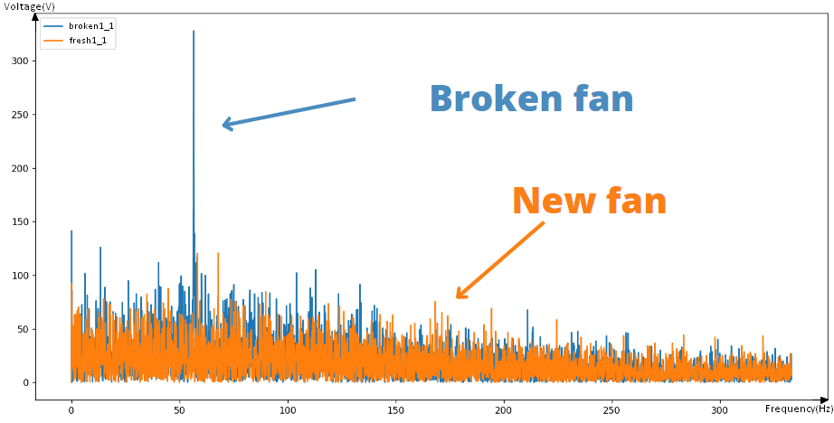
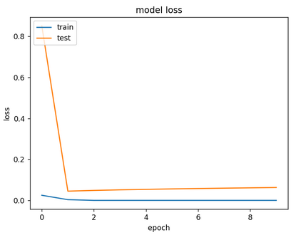
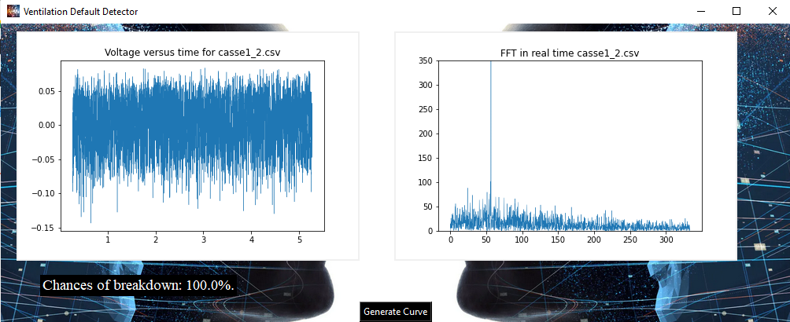

# Digital-Twin
---
## Our project and the IT challenges

<big>The context</big>
***
The aim of our project is to be able to **anticipate breakdowns** in **industrial ventilation**.

For this we use a hot wire which acts as an anemometric sensor. When air arrives on the wire, so that its temperature remains constant, a certain **voltage** is delivered and it is this one that we study.

Using this voltage only, we want to know what state the fans in the duct are/will be in.

<big>Retrieve the data</big>
***
The acquisition was done using a dantec and we recovered .csv files that we could then use

<big>Data processing</big>
***
We can easily get a list of tuples containing (t,U) as here `data=[('0.0001', '1.0684'), ... ,('0.0999', '1.0523'), ('0.1', '1.0602')]`

With `csv.reader`function:

```Python
with open(os.getcwd()+"\\data\\"+name, newline='') as f:
        reader = csv.reader(f)
        data = [tuple(row) for row in reader]
```
Then we put these on two lists `X, Y`.

We then used `scipy.fft`, `scipy.fftfreq` to get the FFT of the signal.

```Python
SAMPLE_RATE= np.mean([X[k+1]-X[k] for k in range(len(X)-1)])
N = len(X)
yf = fft(Y)
xf = fftfreq(N, SAMPLE_RATE)
```
Such parameters are based on the number of points in the file because we had some issues with our acquisition card which sometimes made acquisitions with non-constant numbers of points.



## The place of AI in the project



## The final product with graphics




## Exemple
Here is a video of our [application](https://www.youtube.com/watch?v=_6Yb9YLgItU&list=PL_7_H9j4EBUP2sV3jfq105vpyNiUSdNKO&index=3 "Digital-Twin application.").

