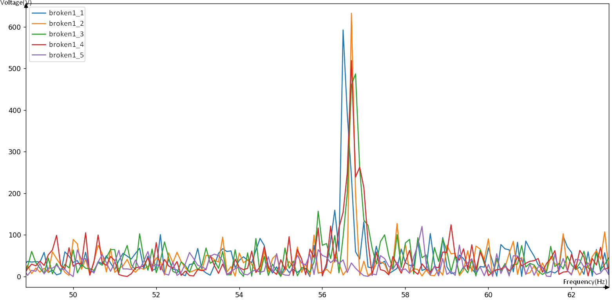

# Digital-Twin
---
## Our project and the IT challenges

### The context

The aim of our project is to be able to **anticipate breakdowns** in **industrial ventilation**.

For this we use a hot wire which acts as an anemometric sensor. When air arrives on the wire, so that its temperature remains constant, a certain **voltage** is delivered and it is this one that we study.

Using this voltage only, we want to know what state the fans in the duct are/will be in.

### Retrieve the data

The acquisition was performed using the `nidaqmx` module which uses our NIDAQ acquisition card.

We choose the frequency and the acquisition time, then we record 5 excelments one after the other containing the time and voltage data that we will then convert in .csv files to exploit them.

```Python
df1=pd.DataFrame(Signal1)
df1.to_excel('signal1.xlsx')
print('Recording 1 OK')
[...]
df5=pd.DataFrame(Signal5)
df5.to_excel('signal5.xlsx')
print('Recording 5 OK')
```

### Data processing
We can easily get a list of tuples containing (t,U) as here `data=[('0.0001', '1.0684'), ... ,('0.0999', '1.0523'), ('0.1', '1.0602')]`.

With `csv.reader`function:

```Python
with open(os.getcwd()+"\\data\\"+name, newline='') as f:
        reader = csv.reader(f)
        data = [tuple(row) for row in reader]
```
Then we put these on two lists `X, Y`.

We then used `scipy.fft`, `scipy.fftfreq` to get the FFT of the signal.

```Python
SAMPLE_RATE= np.mean([X[k+1]-X[k] for k in range(len(X)-1)])
N = len(X)
yf = fft(Y)
xf = fftfreq(N, SAMPLE_RATE)
```
Such parameters are based on the number of points in the file because we had some issues with our acquisition card which sometimes made acquisitions with non-constant numbers of points.

We can easily see now that when comparing both ffts of a broken fan and a clean one,  we can see new frequences 


And when a blade is removed from the fan, we most of the time see frenquency lines at 57Hz:



Unfortunately, this is not at simple as that and knowing that degradations do not happen suddenly and as our role is to predict themand not to detect them, we decided to use an artificial intelligence model. 

## The place of AI in the project

The principle is to present cases of degradation to a neural network so that it can train itself and then anticipate a type of degradation.

### Train a model
***
For the first AI model we wanted something simple: You enter a curve (points list) and you get as a binary output, if the fan was broken/damaged or not.

#### Choice of model type

Our first LAYER is an **input** with the **number of points of an ascquisition**.
```Python
LAYERS = [keras.layers.Input(n_max,dtype="float32")]
```
Then we add some LAYERS to train:
```Python
for k in range(3):
    LAYERS.append(keras.layers.Dense((64//(2**k)),activation="relu",dtype="float32"))
```

Finally ,the last LAYER had to be a sigmoid to get our **binary output**.

```Python
LAYERS.append(keras.layers.Dense(1,activation="sigmoid"))
```

```Python
model = tf.keras.Sequential(LAYERS)
model.summary()
model.compile(
    optimizer=tf.optimizers.Adam(),
    loss='mse',
    metrics=[tf.keras.metrics.BinaryAccuracy()])

```
**Adam** is a classical choice for *Stochastic optimisation*.(the model makes random oriented modifications that it chooses according to the results it obtains on its own calculations)

About `mse` loss choice: **MSE** ensures that our trained model does not have outliers with huge errors, as MSE gives more weight to these errors due to the squared function.

Disadvantage: if our model makes a single very bad prediction, the squared part of the function amplifies the error. 

In our case it is to be avoided that a broken fan is not detected as such, so the MSE error seems very relevant 


#### Mutiply the amount of data

As the **number of experiments** was limited and required **real-life conditions**, we needed to be able to use a small set of data to the maximum. As we are working on flows, slices of 5 seconds or even one second would be more than sufficient, given the speed of rotation of a blade, which is **greater than 60 Hz**. We therefore split each signal into **sub-samples**, which could allow us to obtain a large number of FFTs, all different, representing different moments of a similar situation, but with periods large enough to be relevant.

By doing this for several different situations (several experiments), we obtained a **large data set**.
```Python
def random_strip(N,X,Y):
    L = len(X)
    x0 = np.random.randint(0,L+1-N)
    return(X[x0:x0+N],Y[x0:x0+N])
```

Then when training the data we could easily have several numbers of samples from a single signal.

```Python
for i in range(1000):
    X2,Y2 = random_strip(len(X)//2,X,Y)
     [...]
    xf,yf=fftfreq(N,SAMPLE_RATE),fft(Y2)
```

These methods were used in `random_strip` and `fill_in` functions, before generating the model.

#### Generate the model
```Python
def create_model(curves = []):
    if(len(curves) == 0):
        remplir(curves)
        normaliser(curves)
    n_max = max([len(curves[3*k]) for k in range(len(curves)//3)])


    LAYERS = [keras.layers.Input(n_max,dtype="float32")]
    for k in range(3):
        LAYERS.append(keras.layers.Dense((64//(2**k)),activation="relu",dtype="float32"))
    LAYERS.append(keras.layers.Dense(1,activation="sigmoid"))
    model = tf.keras.Sequential(LAYERS)
    model.summary()
    model.compile(
        optimizer=tf.optimizers.Adam(),
        loss='mse',
        metrics=[tf.keras.metrics.BinaryAccuracy()])
    history = model.fit(
        np.array([curves[3*k+1] for k in range(len(curves)//3)]),
        np.array([curves[3*k+2] for k in range(len(curves)//3)]),
        epochs=10,
        verbose=1,
        validation_split = 0.2)
    plt.plot(history.history['loss'])
    plt.plot(history.history['val_loss'])
    plt.title('model loss')
    plt.ylabel('loss')
    plt.xlabel('epoch')
    plt.legend(['train', 'test'], loc='upper left')
    plt.show()

    L_estime = model.predict([curves[3*k+1] for k in range(len(curves)//3)]).tolist()

    err = 0
    for k in range(len(curves)//3):
        if(k < len(curves)//6 and L_estime[k][0]>0.5):
            err += 1
        if(k>= len(curves)//6 and L_estime[k][0]<0.5):
            err += 1
    print(err," erreur, sur ",len(curves)//3, " exemples")
    model.save("mymodel")
    return(err,model,history)
```

### Model performance

As we wanted to know the error rate as a function of the type of learning, we carried out score tests on the performance.


With the help of this graph it is easy to understand that overlearning should be avoided for this project.

### Multi-categorical categorification 

With the precedent AI, we can recognize two categories of objects. However, we may have more than 2 categories. This is for example important if we need to diferentiate many differents type of issues.

#### New Structure

In this case, we change the outputs to be an array of n floats where n represents the number of categories. The activation function was altered to `softmax`:

```Python
LAYERS.append(keras.layers.Dense(len(C[2]),activation=tf.keras.activations.softmax))
```

Which ensures that all outputs are between 0 and 1 and their total sum is equal to 1. 

As a result, they can be viewed as **probabilities** : 

For exemple,`[0,0.04,0.96]` would mean that the model considers the entry to be of the 3rd category. 


Note: To accurately assess the performance of the model, the metric used has been changed to `tf.keras.metrics.CategoricalAccuracy()`.

#### Results

It was difficult to obtain satisfactory results for this part, but it is being improved and this technique is promising.

## The final product with graphics


## Exemple
Here your can see some demonstrations on the thing in action:

   - [1st version of the app](https://www.youtube.com/watch?v=_6Yb9YLgItU&list=PL_7_H9j4EBUP2sV3jfq105vpyNiUSdNKO&index=3 "Digital-Twin application.")
   
   
   - [2d version of the app](https://youtu.be/pZooMAW_KgA")


